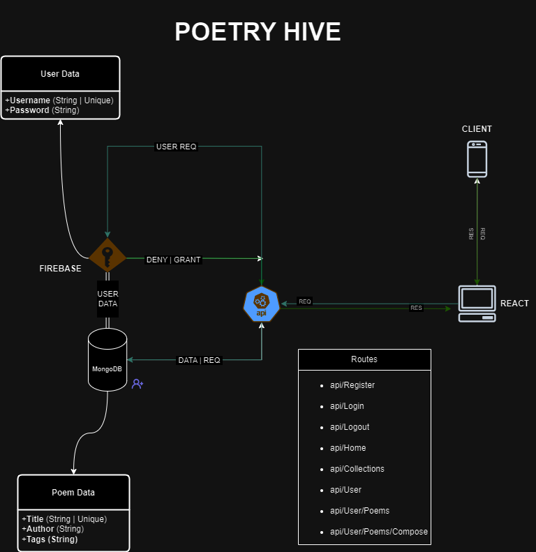

# Poetry Hive
This is a web-based poetry platform with a focus on user expression, It's part of my final year ALX project and acts as the capstone project concluding my back-end specialization

## Team Members
[Ntokozo Vilakazi] - Full-Stack Developer

## Project Description
Poetry Hive is a web-based poetry platform that allows users to create poetic pieces, discover fellow artists, and ultimately find their inner voice. The platform will offer essential features like composition, collaboration, sharing with peers, and weekly events, ensuring a user-friendly interface.

## Learning Objectives
Frontend Development: Deepen understanding of React.js, state management, and component-based architecture.
Backend Development: Gain proficiency in Node.js for server-side logic and MongoDB for database management.
Authentication: Implement secure user authentication mechanisms.
User Experience: Design and develop an intuitive and engaging user interface.

## Technologies Used
Frontend: React.js, JavaScript, CSS, HTML
Backend: Node.js, Express.js
Database: MongoDB

## Third-Party Services
Hosting: Heroku
Authentication: Firebase Authentication

## Challenges Identified
API Rate Limits: Ensuring efficient usage of the API requests to avoid exceeding rate limits.
Data Security: Granting resource access rights to authorized users.
User Interface: Creating a visually appealing and intuitive user interface.

### Mock-ups

